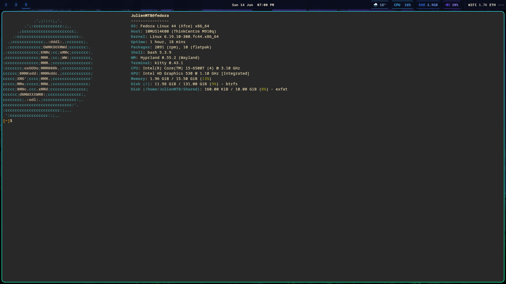
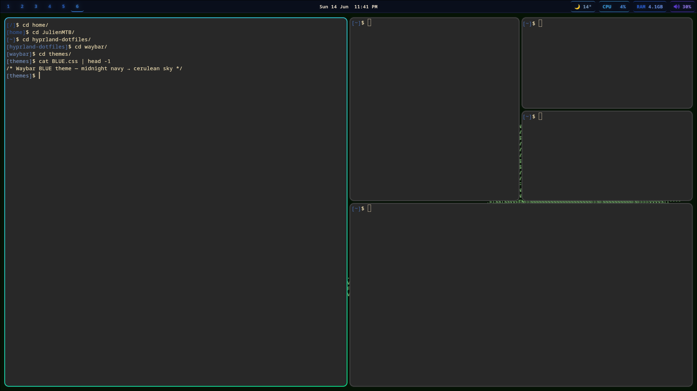
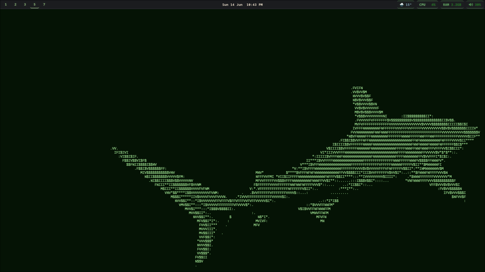
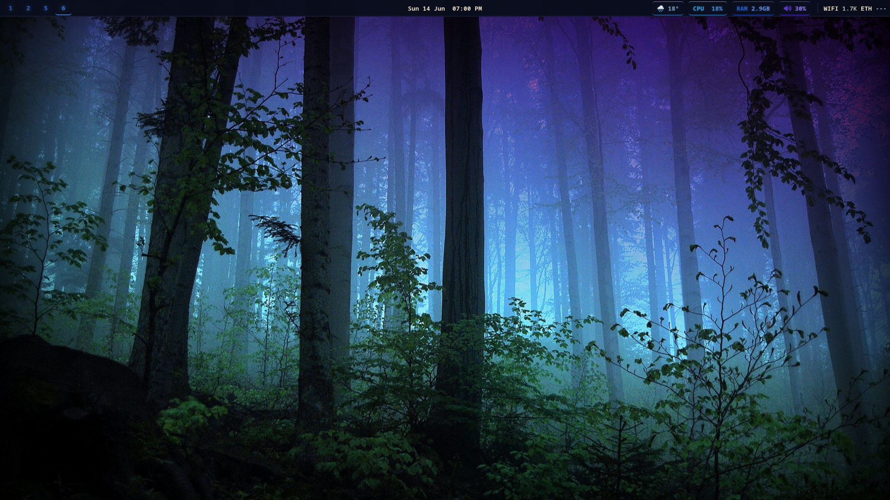
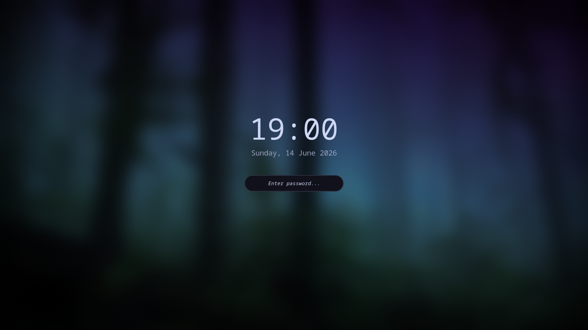

# hyprland-dotfiles

A curated, **out-of-the-box** Hyprland desktop for Fedora/Wayland — tiling WM,
a themeable Waybar with 8 colour schemes, and a matching Hyprlock lock screen.
Install the dependencies, run `./install.sh`, log into Hyprland.

> Built on a single 1920x1080 display (`DP-1`). Single-monitor; adjust the
> `monitor` line and Waybar network interfaces for your hardware (see Notes).

---

## Screenshots

**Workspace with windows** — kitty + fastfetch, BLUE theme


**Dwindle tiling** — kitty terminals split across the layout


**Workspace 3 — GREEN theme**


**Bare desktop** — wallpaper + bar only


**Lock screen** — Hyprlock with blurred wallpaper, live clock, password field


---

## Setup

### 1. Install dependencies

**Fedora:**
```bash
sudo dnf install hyprland hyprlock hypridle hyprpaper waybar kitty wofi mako \
  grim slurp wl-clipboard jq pavucontrol wireplumber playerctl btop fastfetch \
  google-noto-sans-mono-fonts google-noto-emoji-color-fonts
```
**Arch:**
```bash
sudo pacman -S hyprland hyprlock hypridle hyprpaper waybar kitty wofi mako \
  grim slurp wl-clipboard jq pavucontrol wireplumber playerctl btop fastfetch \
  noto-fonts noto-fonts-emoji
```

Two tools aren't in the base repos — install them separately:
- **`satty`** (screenshot annotator, bound to `Print`) — `cargo install satty` or your distro's COPR/AUR
- **`wttrbar`** (weather module backend) — `cargo install wttrbar`

### 2. Clone and install

```bash
git clone https://github.com/JulienChagnon/hyprland-dotfiles.git
cd hyprland-dotfiles
./install.sh
```

`install.sh` is safe and idempotent — it **backs up** anything it would replace
under `~/.config` to `~/.config/.dotfiles-backup-<timestamp>/` before copying. It:

1. Installs `hypr/ waybar/ kitty/ wofi/ fastfetch/` into `~/.config/`
2. Copies the helper scripts into `~/.local/bin/` (and marks them executable)
3. Copies the wallpapers into `~/Pictures/wallpapers/`

### 3. Finish

- Ensure `~/.local/bin` is on your `PATH` (e.g. add `export PATH="$HOME/.local/bin:$PATH"` to `~/.bashrc`).
- Reload Hyprland with `SUPER+SHIFT+R`, or log into a fresh Hyprland session.

> **Paths are portable** — configs use `$HOME`/`~`, never a hardcoded username,
> so the repo works for any user once installed.

---

## What's included

| Path | Component |
|------|-----------|
| `hypr/` | Hyprland, Hyprlock, Hypridle, Hyprpaper configs + keybind cheatsheet |
| `waybar/` | Bar config, active stylesheet, and 8 theme pairs in `themes/` |
| `kitty/` | Terminal config + theme |
| `wofi/` | Stylesheets for the launcher/picker menus |
| `fastfetch/` | Compact system-info layout |
| `bin/` | 19 helper scripts the keybinds/modules depend on |
| `wallpapers/` | The three bundled wallpapers |
| `install.sh` | Deploys everything to the right locations |

---

## Hyprland

Tiling `dwindle` layout, `SUPER` mod key, 10px rounding, gradient borders,
blur + shadows, and custom bézier animations.

| Binding | Action |
|---------|--------|
| `SUPER + Q` | Terminal (kitty) |
| `SUPER + R` | App launcher (`wofi --show drun`) |
| `SUPER + SPACE` | Quick-launcher (pinned apps — edit `hypr/launch-apps.conf`) |
| `SUPER + A` | **App grid** — Chrome · Obsidian · VSCode · Google Chat |
| `SUPER + X` | Close window · `SUPER + F` float · `SUPER + J` toggle split |
| `SUPER + Arrows` | Move focus |
| `SUPER + 1…0` | Switch workspace · `SUPER + SHIFT + 1…0` move window |
| `SUPER + S` | Toggle special "magic" workspace |
| `SUPER + L` | Lock (Hyprlock) · `SUPER + M` power menu |
| `SUPER + W` | Wallpaper picker · `SUPER + O` Waybar theme picker |
| `SUPER + H` | Keybinding cheatsheet (close with `SUPER + X`) |
| `Print` | Region screenshot → annotate (`grim` + `slurp` + `satty`) |

Idle behaviour (`hypr/hypridle.conf`): lock at 14 min, suspend at 15 min.

---

## Waybar


A 36px top bar: workspaces (empty ones hidden) · centered clock · weather, CPU,
RAM, volume, tray, and fixed-width Wi-Fi/Ethernet counters. Click CPU for `btop`,
RAM for a 30-min usage chart, volume for `pavucontrol`.

**8 themes** — `BEIGE, BLUE, BROWN & GREEN, COPPER, DARKRED, GREEN, GREY, TRD`.
Press `SUPER + O` to switch: the picker copies the chosen `themes/<NAME>.{css,jsonc}`
over the live `style.css`/`config.jsonc`, reloads the bar, and re-tints the window
borders to match.

---

## Hyprlock

Blurred wallpaper (dimmed) behind a large live clock, the date, and a password
field with check/fail colour states. See `hypr/hyprlock.conf`.

---

## Wallpapers

Three are bundled in `wallpapers/` and installed to `~/Pictures/wallpapers/`:

| File | Used as |
|------|---------|
| `wallhaven.png` | Default (Hyprpaper + Hyprlock) |
| `enchanted-forest.jpg` | Alternate |
| `shark.png` | Alternate |

Switch live with `SUPER + W`, or drop your own into `~/Pictures/wallpapers/`.

---

## Notes

- **Network modules**: `waybar/config.jsonc` passes interface names `wlan0`
  (Wi-Fi) and `enp0s31f6` (Ethernet) to the `waybar-net` script — change these to
  match your machine (`ip -br link`).
- **Monitor**: `hypr/hyprland.conf` uses `monitor = , preferred, auto, auto`
  (auto-detects). The lock/wallpaper restore logic assumes a single output.
- **App grid icons**: `SUPER + A` references icon files under
  `/usr/share/icons/Mint-Y/`; install the Mint-Y icon theme or edit the paths in
  `bin/hypr-app-launcher` if the icons don't appear.
- **wttrbar**: the weather module wraps the `wttrbar` binary; it auto-detects
  location by IP — no coordinates are stored in this repo.
